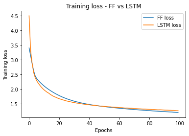
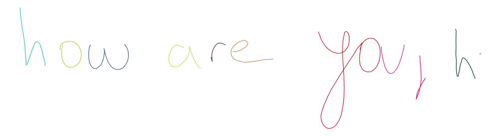
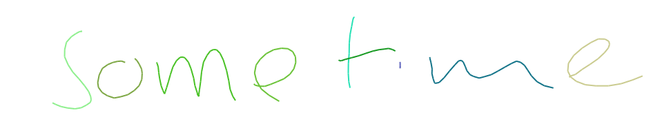
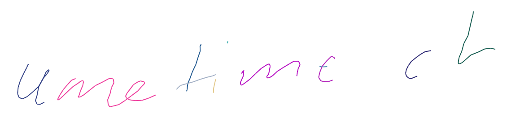
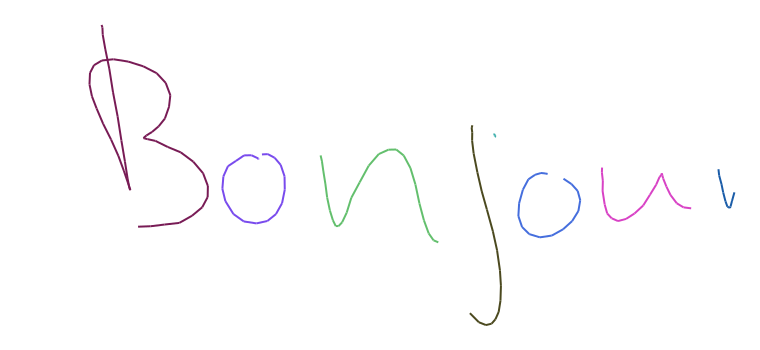
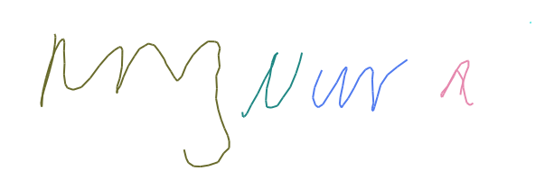

# Flipflop Experiments

Repository contains list of experiments in various applications to showcase
the generalization capacity of flipflop network

## List of experiments

- [Shakespeare text generation](#shakespeare-text-generation)

- [Handwriting generation](#handwriting-generation)

- UCF 11/101 action recognition

- Sentiment Analysis

- Moving square next frame prediction

- Signal reconstruction

- Predict lung volume from CT scans

- Predict next frame in moving MNIST

- Phoneme recognition

- Magenta sketch

---

### Shakespeare text generation

Text generation model trained at character-level.

Code directory: `shakespeare/`

Sample output of flipflop network,

```
ROMEO:
Is not it! Voluble; give your general saint;
She were all: this is come brush'd alove,
And traitor him for rude, that back again; yet sure,
Yet a mind bid me with repity here.

RICHOOS:
I have becamed done, as you perchance and tell thereof,
Both in the beggar hate, conlein on thy brother:
Yet beggar to the faith, yet he, as he' whom was
That I, unreasons, with a leave, and blunt goodly.

KING EDWARD IV:
Now it that violent cuttain
Presence; and weigh affection,
His troth?--'tod God, I!
Shall I am never speak, that I have gone.

Ventious,
She have is lates of that say the cincer:
Under the sortuness joy is fooler;
And rather mother from the banish.
Very go twal liberty, who comest thou
deny to and time, and soil-whum doublied mine.
Because hath he shall have entertatching dam
Our pace of darmward in govern wing
Of fly.

First Keeper: I willow'd with chamber, to been the people.
Call, not breathed more authority to with some
jefty malice; thou art dangerous are not news
Is news Petruch
```

**Performance comparison with LSTM**



### Handwriting generation

Handwriting generation model trained on IAM online handwriting data. The
architecture used is similar to
[Generating Sequences With Recurrent Neural Networks](https://arxiv.org/abs/1308.0850)

The data preprocessing and config files are taken from
[github.com/snowkylin/rnn-handwriting-generation](https://github.com/snowkylin/rnn-handwriting-generation)

Code directory: `handwriting-gen/ff` contains flipflop's and `handwriting-gen/lstm`
contains LSTM's. Saved models for both are available

**Performance comparison with LSTM**

Flipflop output - 'how are you?'



LSTM output - 'how are you?'


Flipflop output - 'sometime'



LSTM output - 'sometime'



Flipflop output - 'Bonjour'



LSTM output - 'Bonjour'


